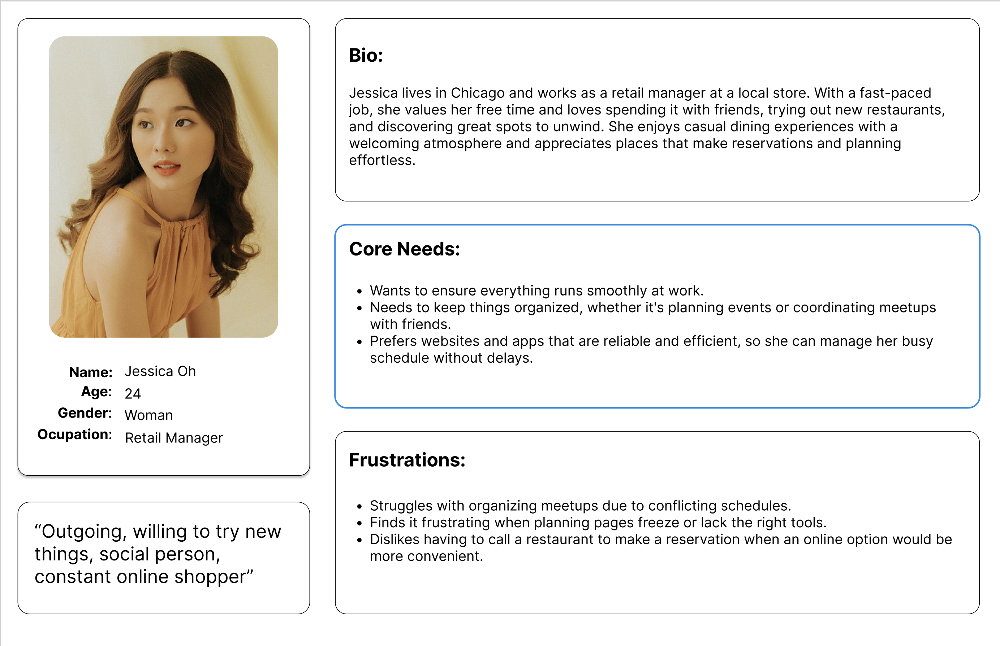
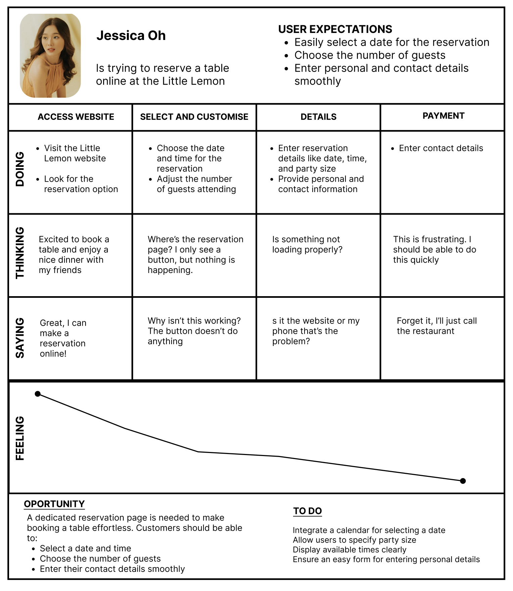
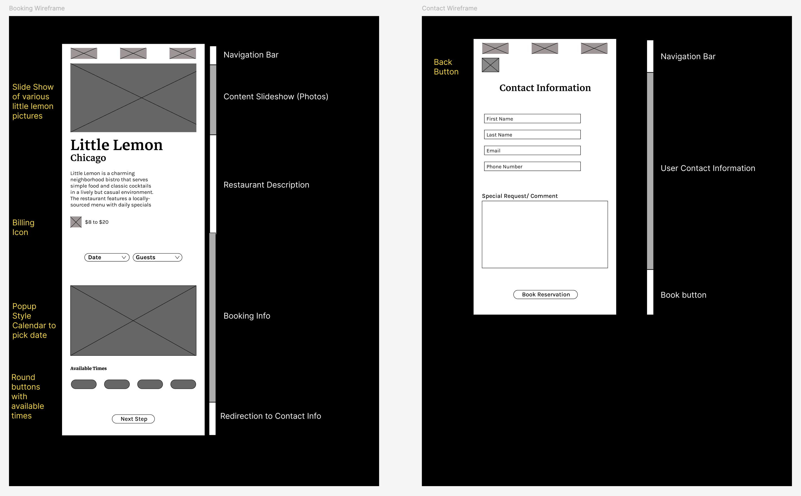
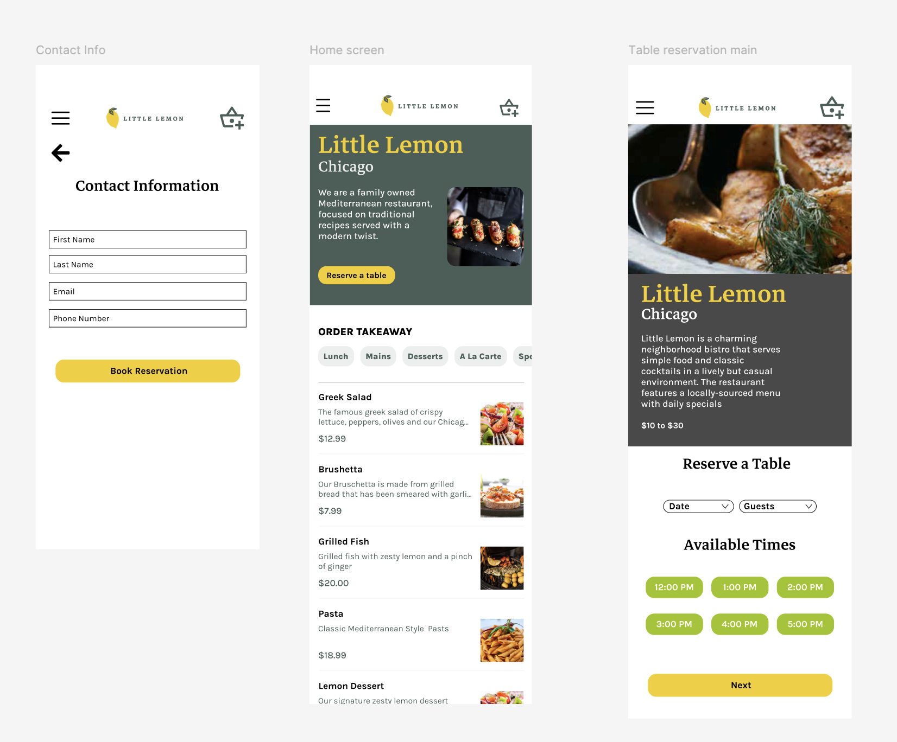

# Little Lemon Website Mobile Prototype – Capstone Project

**Principles of UI/UX Design Specialization – Meta**  
**Last Updated: February 28, 2025**

---

## 1. Project Overview
This capstone project focuses on designing a mobile-friendly user interface and user experience (UI/UX) for the Little Lemon restaurant website, located in Chicago. The goal is to create an intuitive, efficient, and visually appealing online reservation system that allows users to book a table effortlessly. The project incorporates user personas, wireframes, a high-fidelity prototype, and a detailed user journey to ensure alignment with user needs and expectations.

---

## 2. User Persona
### Profile: Jessica Oh
- **Name:** Jessica Oh  
- **Age:** 24  
- **Gender:** Woman  
- **Occupation:** Retail Manager  
- **Personality:** Outgoing, social, willing to try new things, constant online shopper  

### Bio
Jessica lives in Chicago and works as a retail manager at a local store. With a fast-paced job, she values her free time and loves spending it with friends, trying out new restaurants, and discovering great spots to unwind. She enjoys casual dining experiences with a welcoming atmosphere and appreciates places that make reservations and planning effortless.

### Core Needs
- Wants to ensure everything runs smoothly at work.  
- Needs to keep things organized, whether it’s planning events or coordinating meetups with friends.  
- Prefers websites and apps that are reliable and efficient, so she can manage her busy schedule without delays.  

### Frustrations
- Struggles with organizing meetups due to conflicting schedules.  
- Finds it frustrating when planning pages freeze or lack the right tools.  
- Dislikes having to call a restaurant to make a reservation when an online option would be more convenient.

---

## 3. User Journey and Actions
The user journey for Jessica Oh, as she attempts to reserve a table online at Little Lemon, is mapped out to identify her expectations, actions, thoughts, feelings, and pain points. This journey informs the design of the prototype and ensures it addresses her needs effectively.

### User Expectations
- Easily select a date for the reservation.  
- Choose the number of guests.  
- Enter personal and contact details smoothly.  

### Journey Breakdown

| **Stage**           | **Doing**                                                                 | **Thinking**                                                                 | **Saying**                                  | **Feeling**                     |
|---------------------|---------------------------------------------------------------------------|-----------------------------------------------------------------------------|---------------------------------------------|---------------------------------|
| **Access Website**  | - Visit the Little Lemon website.   - Look for the reservation option. | - Excited to book a table and enjoy a nice dinner with my friends.          | - Great, I can make a reservation online!   | 😊 (Positive)                   |
| **Select and Customize** | - Choose the date and time for the reservation.   - Adjust the number of guests attending. | - Where’s the reservation page? I only see a button, but nothing is happening. | - Why isn’t this working? The button doesn’t do anything. | 😕 (Frustrated, Confused)       |
| **Details**         | - Enter reservation details like date, time, and party size.   - Provide personal and contact information. | - Is something not loading properly?                                         | - Is it the website or my phone that’s the problem? | 😣 (Annoyed, Uncertain)          |
| **Payment**         | - Enter contact details.                                                  | - This is frustrating. I should be able to do this quickly.                 | - Forget it, I’ll just call the restaurant. | 😞 (Disappointed, Resigned)      |

### Feeling Graph
The user’s emotional journey starts with excitement but declines due to usability issues, ending in frustration and resignation. A dedicated reservation page is needed to ensure a smooth and effortless booking process.

---

## 4. Wireframe Design
The wireframe outlines the structure and layout of the Little Lemon mobile website’s reservation system. It includes two key screens:

### Booking Wireframe
- **Navigation Bar:** Top navigation for easy access to other sections.  
- **Content Slideshow (Photos):** Visual representation of Little Lemon’s ambiance and menu.  
- **Restaurant Description:** Brief overview of the restaurant’s offerings (e.g., Mediterranean food, classic cocktails, locally sourced menu, daily specials $10–$30).  
- **Booking Info:**  
  - Dropdowns for selecting Date and Guests.  
  - Pop-up style calendar for picking a date.  
  - Round buttons displaying available times.  
  - “Next Step” button to proceed to contact information.  
- **Redirection to Contact Info:** Seamless transition to the next step in the reservation process.  

### Contact Wireframe
- **Navigation Bar:** Includes a “Back” button for navigation.  
- **User Contact Information:** Fields for First Name, Last Name, Email, and Phone Number.  
- **Special Request/Comment:** Optional text box for additional notes.  
- **Book Button:** Final action to complete the reservation.  

---

## 5. High-Fidelity Prototype
The high-fidelity prototype builds on the wireframe, incorporating colors, imagery, and interactive elements to create a polished mobile interface. It includes three main screens:

### Home Screen
- **Header:** Little Lemon logo, navigation menu, and “Reserve a Table” button.  
- **Content:** Restaurant description, menu items (e.g., Greek Salad, Bruschetta, Grilled Fish, Pasta, Lemon Dessert) with prices and images.  
- **Order Takeaway:** Option for takeout with menu categories (Lunch, Mains, Desserts, A La Carte, Specials).  

### Reservation Screen
- **Header:** Little Lemon logo and navigation.  
- **Reserve a Table Section:** Dropdowns for selecting Date and Guests.  
- **Available Times:** Green buttons for time slots (e.g., 12:00 PM, 1:00 PM, 2:00 PM, 3:00 PM, 4:00 PM, 5:00 PM).  
- **Next Button:** Yellow button to proceed to contact information.  

### Contact Information Screen
- **Header:** Little Lemon logo, navigation, and “Back” button.  
- **Contact Fields:** Input fields for First Name, Last Name, Email, and Phone Number.  
- **Special Request/Comment:** Optional text box for additional notes.  
- **Book Reservation Button:** Yellow button to finalize the reservation.  

### Reservation Complete Screen
- **Confirmation:** Message stating, “Your table has been reserved successfully!”  
- **New Booking Button:** Option to start a new reservation.  

---

## 6. Design Opportunities and Recommendations
Based on Jessica’s user journey and frustrations, the following opportunities and actions are recommended:

### Opportunity
A dedicated reservation page is needed to make booking a table effortless. Customers should be able to:
- Select a date and time.  
- Choose the number of guests smoothly.  
- Enter their contact details efficiently.  

### To Do
- Integrate a calendar for selecting a date.  
- Allow users to specify party size clearly.  
- Display available times prominently.  
- Ensure an easy form for entering personal details, minimizing friction and errors.  

---

## 7. Conclusion
This capstone project demonstrates the application of UI/UX design principles to create a user-centered mobile prototype for Little Lemon’s website. By addressing Jessica Oh’s needs and frustrations, the design ensures a seamless, efficient, and enjoyable reservation experience. The wireframe and prototype provide a solid foundation for development, with clear opportunities for improvement to enhance user satisfaction and engagement.

---
